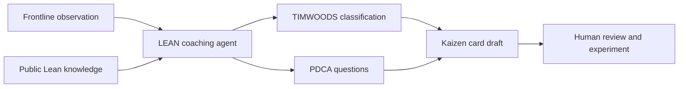

# LEAN Process Improvement Agent

[](https://github.com/Kenny-Yukich/LEAN-Process-Improvement-Agent/actions/workflows/privacy-check.yml)

An AI coaching assistant that helps frontline teams spot waste, structure problems with PDCA, and turn observations into review-ready Kaizen cards.

This repository is a sanitized, employer-neutral portfolio version of a Microsoft Copilot Studio project. It contains no production exports, private knowledge bases, organization identifiers, connection details, email addresses, employee names, or operational records.

## What it does

- Classifies observed waste using TIMWOODS.
- Coaches users through Plan-Do-Check-Act thinking.
- Drafts a concise Kaizen card without inventing facts.
- Suggests practical measures for baseline and follow-up.
- Keeps human review and approval in the loop.
- Falls back to general Lean guidance when organization-specific context is unavailable.



## Example conversation

> **User:** Parts are piling up between cutting and assembly.
>
> **Agent:** That may involve Inventory and Waiting waste. What is the normal queue size, what are you seeing now, and when did the gap begin?
>
> **Agent output:** A draft Kaizen card with the observed condition, target condition, likely waste categories, evidence still needed, a small countermeasure to test, an owner, a check date, and success measures.

## Repository layout

```text
.
|-- src/
|   |-- agent.mcs.yml              # Agent behavior and coaching instructions
|   |-- settings.example.mcs.yml   # Environment-neutral settings example
|   `-- topics/                    # Public Copilot Studio topic examples
|-- knowledge/                     # Employer-neutral grounding content
|-- docs/
|   |-- architecture.md
|   `-- privacy.md
|-- scripts/privacy-check.ps1      # Release gate for private data
`-- .github/workflows/privacy-check.yml
```

## Try the coaching prompt

The core behavior is readable in [`src/agent.mcs.yml`](src/agent.mcs.yml). To test the approach in an AI tool without importing a solution:

1. Use the `instructions` block as the system or agent instructions.
2. Add the Markdown files in [`knowledge/`](knowledge/) as grounding documents.
3. Start with: `Help me turn this observation into a Kaizen card: [describe the condition you observed].`
4. Review every generated statement with the people who do the work before acting on it.

## Use in Microsoft Copilot Studio

These files mirror the readable source format used by Copilot Studio exports, but they are intentionally environment-neutral and are not a complete production solution package.

1. Create a new agent in your own environment.
2. Copy the instructions from [`src/agent.mcs.yml`](src/agent.mcs.yml).
3. Add the public files in [`knowledge/`](knowledge/) as knowledge sources.
4. Recreate or adapt the example topics in [`src/topics/`](src/topics/).
5. Configure authentication, channels, connections, and publisher prefixes inside your environment.
6. Test with fictional data before introducing approved organizational content.

Do not copy connection references or hidden environment-export folders between tenants. The example settings use a placeholder schema prefix that must be replaced in the destination environment.

## Privacy design

This public version follows data minimization:

- Organization-specific knowledge and real improvement logs are excluded.
- Email and other external connector actions are excluded.
- User, tenant, environment, and deployment identifiers are excluded.
- Examples are fictional and contain no real people, products, or process results.
- A CI check blocks common private-export artifacts, email addresses, and secret patterns.

See [`docs/privacy.md`](docs/privacy.md) before adding files or examples.

## Safety and limitations

The agent is a coaching aid, not an autonomous process owner. It should not change production systems, approve procedures, make safety decisions, or claim savings without verified evidence. Human owners remain responsible for experiments, approvals, and standard-work changes.

## Local privacy check

From PowerShell:

```powershell
./scripts/privacy-check.ps1
```

The same check runs on every push and pull request through GitHub Actions.

## Project status

Portfolio-ready reference implementation. The next useful extensions are a structured Kaizen-card export, configurable approval workflow, and evaluation cases for coaching quality.

## License

MIT License. See [`LICENSE`](LICENSE).
